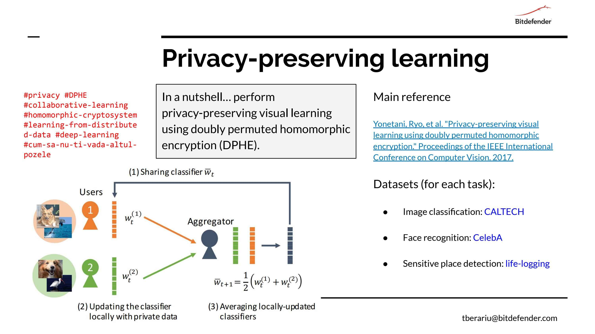

The repository contains an attempt to reproduce the results published in the article [*Privacy-Preserving Visual Learning Using Doubly Permuted Homomorphic Encryption*](http://openaccess.thecvf.com/content_ICCV_2017/papers/Yonetani_Privacy-Preserving_Visual_Learning_ICCV_2017_paper.pdf).

## **Contents**
- [Federated learning](#federated_learning)
- [Problem description](#problem)
- [Solutions](#solutions)
- [Experimental results](#results)
- [Usage and examples](#usage-and-examples)
- [References](#references)

## **Federated learning**

Standard machine learning approaches require centralizing the training data on one machine or in a datacenter. For models trained from user interaction with mobile devices or IoTs, an additional approach was introduced: **Federated Learning**.

Federated Learning enables devices(computers, mobiles, IoTs) to collaboratively learn a shared prediction model while keeping all the training data on device, decoupling the ability to do machine learning from the need to store the data in the cloud. This goes beyond the use of local models that make predictions on smart devices by bringing model training to the device as well.

It works like this: your device downloads the current model, improves it by learning from data on your phone, and then summarizes the changes as a small focused update. Only this update to the model is sent to the cloud, using encrypted communication, where it is immediately averaged with other user updates to improve the shared model. All the training data remains on your device, and no individual updates are stored in the cloud.

**Federated Learning advantages**:

- Ability to learn from multiple users while keeping their privacy.
- No need to store extra data in cloud.
- Less network communication.

## **Problem description**

## **Solutions**

## **Experimental results**

### **1. Reference values**

| References/Dataset | Caltech101 accuracy| Caltech256 accuracy|
| ------------- | ------------- |-------------|
| Article data  | **89.3%**  | **74.7%** |
| Simple linear layer   | **89.0%** | **76.7%**  |

### **2. Unencrypted distributed network**

Distributed network run 100 epochs per users, and 50 epochs per aggregator.

| Workers/Dataset | Caltech101 accuracy/duration| Caltech256 accuracy/duration|
| ------------- | ------------- |-------------|
| 5 workers  | **89.6% / 220s**  | **77.1% / 1117s** |
| 10 workers| **88.9% / 213s** | **77.2% / 1130s**  |
| 50 workers| **87.7% / 310s** | **74.4% / 1296s**  |
| 100 workers| **84.0% / 523s** | **66.7% / 1381s**  |

### **3. Fully encrypted distributed network**

| Workers/Dataset | Caltech101 accuracy/duration| Caltech256 accuracy/duration|
| ------------- | ------------- |-------------|
| 5 workers  | **83% / 3666ss**  | **72% / 9747s** |
| 10 workers| **81% / 6936s** | **68.3% / 17954s**  |

### **4. Encrypted network with sparse updates(keep top 1% deltas and encrypt them)**

| Workers/Dataset | Caltech101 accuracy/duration| Caltech256 accuracy/duration|
| ------------- | ------------- |-------------|
| 5 workers  | **80.7% / 600s**  | **64,7% / 2057s** |
| 10 workers| **77.6% / 805s** | **63.9% / 2594s**  |
| 50 workers| **74% / 2754s** | **55.0% / 7352s**  |
| 100 workers| **71% / 5372s** | **43.2% / 13144s**  |

### **5. Encrypted network with sparse updates(directly learn over delta and use elastic_nets for constraining them)**

| Workers/Dataset | Optimizer | Caltech101 accuracy/duration| Caltech256 accuracy/duration|
| ------------- | ------------- | ------------- |-------------|
| 5 workers  | SGD |  **83.7% / 606s**  | **68.1% / 2137s** |
| 5 workers  | Adam |  **86.2% / 612s**  | **74.1% / 2260s** |

## **Usage and examples**

## **References**

1. Ryo Yonetani, Vishnu Naresh Boddeti, Yoichi Sato: Privacy-Preserving Visual Learning Using Doubly Permuted Homomorphic Encryption. Published in IEEE International Conference on Computer Vision. doi: [10.1109/ICCV.2017.225](https://doi.org/10.1109/ICCV.2017.225)

2. [Federated Learning](https://ai.googleblog.com/2017/04/federated-learning-collaborative.html)
